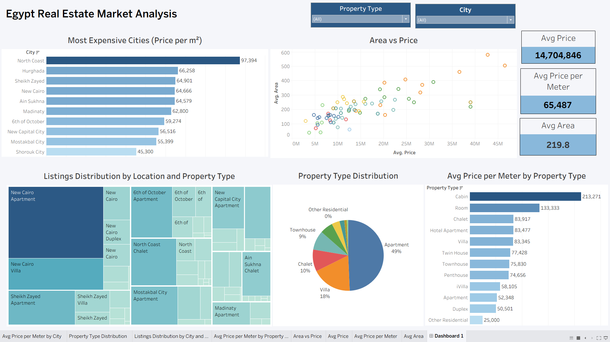

# Egypt Real Estate Market Analysis

## Project Overview
This project analyzes the real estate market in Egypt using data scraped from Bayut Egypt.  
The project covers the full data analysis workflow including data collection, data cleaning, feature engineering, exploratory data analysis, and building an interactive dashboard.

## Project Workflow
1. Web Scraping real estate data from Bayut Egypt
2. Data Cleaning and preprocessing using Pandas
3. Feature Engineering (Price per Square Meter)
4. Exploratory Data Analysis (EDA)
5. Data Visualization
6. Building an interactive Tableau Dashboard

## Tools & Technologies
- Python
- Pandas
- NumPy
- BeautifulSoup
- Matplotlib
- Seaborn
- Web Scraping
- Data Cleaning
- Tableau
- Data Visualization

## Dataset Features
The dataset includes:
- Price
- Area
- Bedrooms
- Bathrooms
- Property Type
- City
- Region
- Latitude
- Longitude
- Agency
- Price per Square Meter

## Key Insights

- North Coast has the highest price per square meter, indicating that coastal properties represent a premium investment and vacation real estate market in Egypt.
- Apartments represent nearly half of the real estate market, making them the most common and most demanded property type in Egypt.
- New Cairo, Sheikh Zayed, and 6th of October have the highest number of listings, indicating that these areas are the most active real estate markets in terms of supply and development.
- There is a positive relationship between property area and total price; however, price per square meter tends to decrease as property area increases, which means larger properties are cheaper per meter but more expensive overall.
- The average property price is around 14.7M EGP, with an average price per meter of 65K EGP and an average property area of approximately 220 m², providing a general overview of the real estate market pricing level.
- Price per square meter varies significantly between cities, indicating that location is one of the most important factors affecting property valuation in Egypt.
## Dashboard

  

## Connect with me

)

